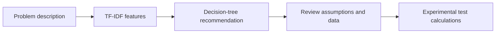

<div align="center">

**From a written question to a statistical method.**

Python · scikit-learn · SciPy · TF-IDF · Decision Trees

[Portfolio](https://harshil-prashant-shah.vercel.app/) · [LinkedIn](https://www.linkedin.com/in/harshilpshah/) · [Explore the code](#repository-guide)

</div>

---

## What this project explores

Selecting a non-parametric test from a natural-language problem description, then exploring the calculations behind runs, Wilcoxon signed-rank, and Mann–Whitney U tests.

### Core components

- TF-IDF unigram and bigram features for question text.
- Decision-tree classification of test type.
- Lookup of problem statements by serial number.
- Experimental test-execution routines and critical-value tables.

## Workflow



## Reproduced result

**25 of 27 test examples correctly classified (92.59%)** using the original random split and classifier settings.

This is a reproduction of the original experiment, not a leakage-free estimate: the 107-record dataset contains 23 duplicate questions, and one question occurs in both training and test sets. See [VALIDATION.md](VALIDATION.md) for the exact setup and limitations.

## Run locally

```bash
python -m venv .venv
source .venv/bin/activate
pip install -r requirements.txt
jupyter lab notebooks/statistical_test_prediction.ipynb
```

On Windows, activate with `.venv\Scripts\activate`. Place the five authorized input files in `data/`, or set `PROJECT_DATA_DIR`. The notebook checks their presence before running. See [DATA_SETUP.md](DATA_SETUP.md).

## Repository guide

- `notebooks/statistical_test_prediction.ipynb` — classifier and test experiments.
- `DATA_SETUP.md` — local dataset instructions.
- `VALIDATION.md` — reproduced classifier result and caveats.
- `requirements.txt` — Python dependencies.

## Interpretation and limitations

A predicted test name does not establish that its assumptions hold. The original statistical calculation routines need further comparison against reference implementations, particularly Wilcoxon decision logic, ties, zero differences, and tail conventions. Use the notebook as a research prototype; do not treat all computed decisions as validated results.

## Research

[Read the associated paper or manuscript](https://link.springer.com/chapter/10.1007/978-3-032-12990-1_27). This reference was supplied by the author; publisher or Drive access conditions may apply. The paper and this repository may represent different project stages.

## About the author

**Harshil Prashant Shah** · MS in Management Information Systems, Texas A&M University.

[Portfolio](https://harshil-prashant-shah.vercel.app/) · [LinkedIn](https://www.linkedin.com/in/harshilpshah/) · [GitHub](https://github.com/harshilshah250504)

## Data and reuse

Local datasets, credentials, and third-party research PDFs are not included. No blanket license is granted over third-party material. Refer to the original sources for their terms before redistributing data or publications.
